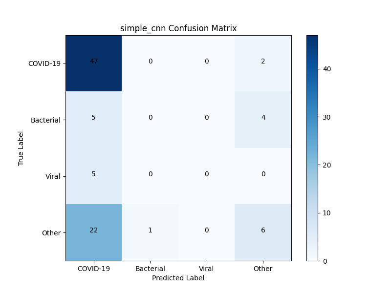
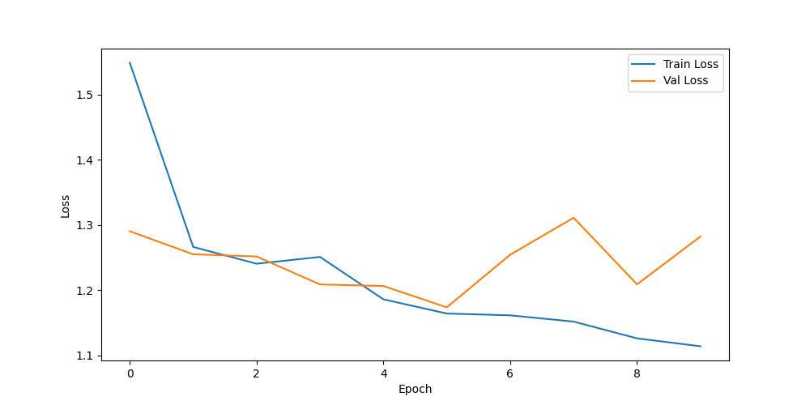
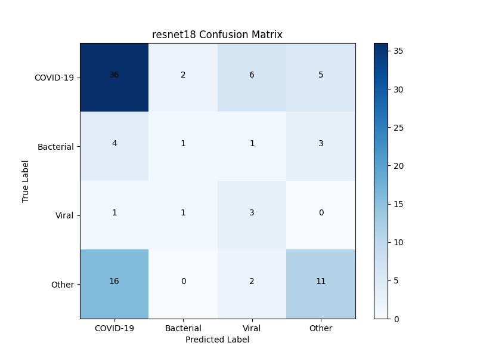
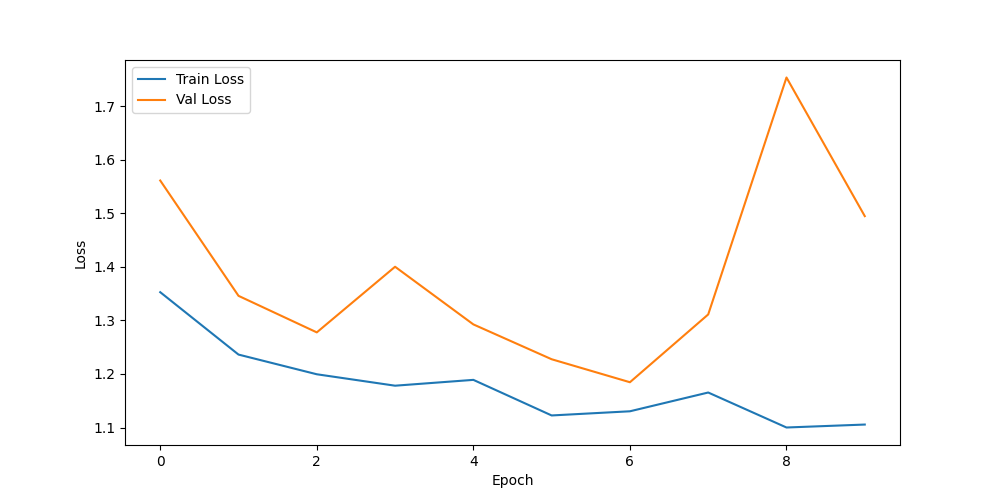

# Deep Learning Project 3: X-ray Infection Diagnosis

This project classifies chest X-ray images into four infection types (COVID-19, Bacterial, Viral, Other) using deep learning models. It was developed as part of a university deep learning course (Project 3).

## Overview

- **Dataset**: The [covid-chestxray-dataset](https://github.com/ieee8023/covid-chestxray-dataset) (914 images: 584 COVID-19, 231 Other, 69 Bacterial, 30 Viral). *Note*: The original dataset is not included in this repository due to size and licensing considerations. Please download it from the provided link.
- **Models**:
  - Simple CNN: Achieved a validation F1 score of 0.5917.
  - ResNet18: Achieved a validation F1 score of 0.5764.
- **Techniques**: Data augmentation (random flips, rotations), weighted loss to handle label imbalance, PyTorch 2.0.1.
- **Hardware**: Trained on a TITAN X GPU (CHPC kingspeak cluster).

## Results

- **Simple CNN**:
  - F1 Score: 0.5917 (epoch 10)
  - Confusion Matrix:
    
  - Loss Curve:
    
- **ResNet18**:
  - F1 Score: 0.5764 (epoch 7)
  - Confusion Matrix:
    
  - Loss Curve:
    

## Requirements

- Python 3.9, PyTorch 2.0.1, torchvision, NumPy, Pandas, Matplotlib, scikit-learn.
- To set up locally:
  ```bash
  python -m venv pytorch_env
  source pytorch_env/bin/activate
  pip install torch==2.0.1 torchvision numpy pandas matplotlib scikit-learn
  ```

## Files

- `project_code/filter_metadata.py`: Preprocesses the dataset, filters .nii.gz files, and generates `metadata_filtered.csv`.
- `project_code/simple_cnn.py`: Trains the Simple CNN model and generates confusion matrix and loss curve.
- `project_code/train_resnet18.py`: Trains the ResNet18 model and generates confusion matrix and loss curve.
- `project_code/Myproject.sh`: Main script to run all steps (preprocessing, Simple CNN training, ResNet18 training) on CHPC.
- Other scripts: `project_code/preprocess_labels.py`, `project_code/covid_dataset.py`, `project_code/test_dataloader.py`, `project_code/train_model.py`.
- Outputs: `project_code/metadata_filtered.csv`, `project_code/report.pdf`, `project_code/*.png` (figures).

## Running the Project Locally

1. **Download the dataset**:
   - Clone the dataset repository:
     ```bash
     git clone https://github.com/ieee8023/covid-chestxray-dataset.git
     mv covid-chestxray-dataset/images .
     mv covid-chestxray-dataset/metadata.csv .
     ```
2. **Run each step**:
   ```bash
   cd project_code
   python filter_metadata.py
   python simple_cnn.py
   python train_resnet18.py
   ```

## Notes

- The dataset must be placed in the `images/` subdirectory with `metadata.csv`.
- Model files (`*.pth`) are excluded due to GitHub size limits but can be generated by running `simple_cnn.py` and `train_resnet18.py`.
- Total runtime on a TITAN X GPU is approximately 3-4 hours.
- Full analysis is available in `project_code/report.pdf`.

## License

This project is licensed under the MIT License - see the [LICENSE](LICENSE) file for details.

## Contact

For inquiries, please reach out via [LinkedIn](https://www.linkedin.com/in/your-profile)